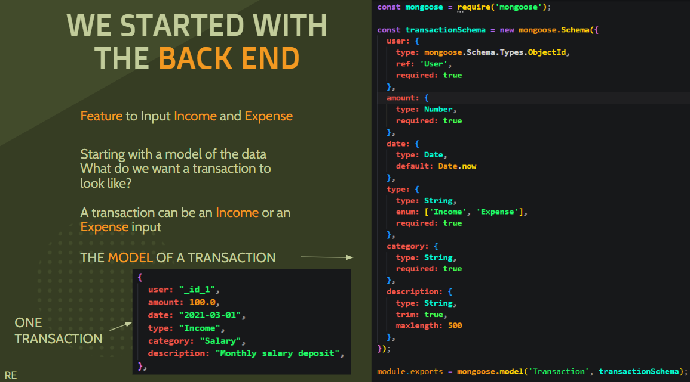

## Technology Used - This is a MERN API

## Description

[Visit the Deployed "Wealth Builder" site](https://wealth-builder-d2d82a6766d2.herokuapp.com/) 👀

Many of us ask ourselves at the end of the month “Where’d all my money go?!”  Wealth Builder allows users to answer that question.  Wealth Builder creates a safe online accounting form to keep track of a user's money coming in and money going out during the course of a month. 

Wealth Builder also provides several points of encouragement to try and get users thinking about saving their money instead of just spending it. Wealth Builder does this by allowing the user to create savings goals with encouraging goal notifications such as “Great job you're almost there”!  Wealth Builders' use of real-time data showing stock prices and finance news gets a user thinking about how to use their money as an investment.

## Table of Contents

- [How To Install](#how-to-install)
- [Usage & Features](#usage-and-features)
- [Code Examples](#code-examples)
- [Author Info](#author-info)
- [License](#license)

## How To Install

1. Copy this GitHub repository down to your local drive.
2. Open the folder where you placed the files from this repository on your local drive with your Git terminal. Make sure you can see the server.js file and also the package.json file.
3. Type "run npm init" this will install the necessary node.js modules.
4. Type “npm install” to install all the necessary dependencies that are called out in the package.json file.
5. Type “npm run start” If you have everything set up correctly you can open http://localhost:3000” (it should open for you automatically) And you will see the site Wealth Builder.

## Usage and Features

### User Stories

### User Stories Converted To GraphQL Queries and Mutations

We used Bootstrap as the basis of our framework, along with custom CSS

#### Here Is The Mobile Responsiveness

## Code Examples

### How A Feature Was Developed Using GraphQL and React

We started in the back end by modeling out how we wanted a data set to look.  Here is the Model and Seed for a Transaction

Then we made the GraphQL Resolver to add the Transaction to the MongoDB

Then on the front end we used React to build a Transaction Component

Then we made the GraphQL Mutation to move the Transaction into the MongoDB from the front end (When the User enters it in)

## Author Info

If you made it this far "thank you!" 😁🙏👍 We appreciate you taking such a thorough look at our work. If you would like to contact us or see more of our work please use the links below.

### Aaron Torres

### Christina Larsen

### Ryan England

### Steven Sills II

### Thomas Er

## License

Permission is hereby granted, free of charge, to any person obtaining a copy
of this software and associated documentation files (the "Software"), to deal
in the Software without restriction, including without limitation the rights
to use, copy, modify, merge, publish, distribute, sublicense, and/or sell
copies of the Software, and to permit persons to whom the Software is
furnished to do so, subject to the following conditions:

The above copyright notice and this permission notice shall be included in all
copies or substantial portions of the Software.

THE SOFTWARE IS PROVIDED "AS IS", WITHOUT WARRANTY OF ANY KIND, EXPRESS OR
IMPLIED, INCLUDING BUT NOT LIMITED TO THE WARRANTIES OF MERCHANTABILITY,
FITNESS FOR A PARTICULAR PURPOSE AND NONINFRINGEMENT. IN NO EVENT SHALL THE
AUTHORS OR COPYRIGHT HOLDERS BE LIABLE FOR ANY CLAIM, DAMAGES OR OTHER
LIABILITY, WHETHER IN AN ACTION OF CONTRACT, TORT OR OTHERWISE, ARISING FROM,
OUT OF OR IN CONNECTION WITH THE SOFTWARE OR THE USE OR OTHER DEALINGS IN THE
SOFTWARE.